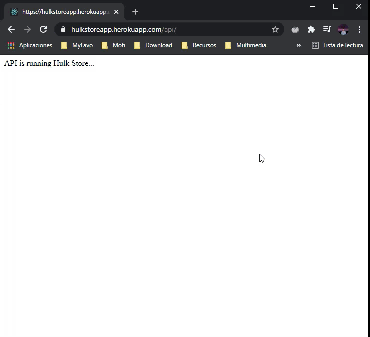

# [Hulk Store](https://hulkstoreapp.herokuapp.com/api/)

Api Sitio Web Hulk Store.

### URL

* [Product](https://hulkstoreapp.herokuapp.com/api/products) /api/products
* [Users] /api/users
* [Ordes] /api/orders

[Ver](https://hulkstoreapp.herokuapp.com/api/).

### Recursos
* [Frontend Hulk Store](https://github.com/Kulnois/hulk-store-web)
* [Node](https://nodejs.org/en/)
* [Express](https://expressjs.com/)
* [Mongodb](https://mongoosejs.com/)
* [Mongoose](https://www.mongodb.com/)
* [bcryptjs]
* [jsonwebtoken](https://jwt.io/)

## Instalación
1. [Download](../../archive/master.zip) o clonar el repositorio.
2. Instalar dependencias con `npm install`.

## Server

### Desarrollo

Ejecutar `npm run server` e ir al navegador a la ruta [http://localhost:5000](http://localhost:5000).